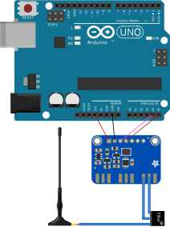

# rtty-arduino-beacon-audio

Implementacion de una baliza RTTY en Arduino usando el modulo Si5351 que opera desde 8Khz a 144MHz. Permite poner un texto que va a ser modulado en RTTY (default 45.5 Baudios) por la salida *0* del modulo Si5351. Se deberia utilizar un filtro dependiendo la frecuencia en la que utilizarse. Para probar con un cable estamos bien.

[](https://www.youtube.com/watch?v=5N3AuJ1Rmb8)

Es un proyecto simple y basico para experimentar con Arduino en el ambito de la radioaficion. Es una adaptacion de otros proyectos mas simples:

- [cw-arduino-beacon](https://github.com/lu1aat/cw-arduino-beacon/)
- [rtty-arduino-beacon-audio](https://github.com/lu1aat/rtty-arduino-beacon-audio)

Si es lo primero que haces con Arduino, antes tenes que leer un tutorial de Arduino https://www.arduino.cc/en/Guide/HomePage y hacer los ejercicios basicos (titilar, leer un boton, etc). 


## Instrucciones

* Bajar este repositorio o el archivo `rtty-arduino-beacon-si5351.ino`.
* Abrir el archivo con la IDE de Arduino (https://www.arduino.cc/en/main/software).
* Subir el programa al microcontrolador Arduino UNO o compatible.
* Conectar el modulo Si5351 de la siguiente forma:
    * Arduino 3V    -   Si5351 VIN
    * Arduino GND   -   Si5351 GND
    * Arduino A4    -   Si5351 SDA
    * Arduino A5   -    Si5351 SCL



**Usar un filtro** acorde a la frecuencia donde se desea transmitir. Para hacer pruebas sin soldar el conector SMA se puede usar la salida _0_ del Si5351 y un cable como antena.

La baliza deberia comenzar a transmitir inmediatamente y hacer pausas de un minuto entre transmisiones.


## Configurando la baliza

Si no modificamos nada, la baliza comenzara a transmitir con los parametros por defecto. Para modificar estos parametros hay que usar la IDE de arduino, editar el codigo y subirlo nuevamente al microcontrolador.

### Mensaje

El mensaje por defecto esta definido en la linea, soporta solo letras en mayusculas y numeros:

```c++
char MESSAGE[] = "CQ CQ CQ DE N0CALL N0CALL N0CALL";
```

Cambiando el valor entre comillas se modifica el mensaje de la baliza. El mensaje por defecto demora en transmitirse 7 segundos aproximadamente.

### Tono

Algunos parametros de los tonos se pueden cambiar en:

```c++
const long markFreqHz = 2125UL;                     // Tono para MARK
const long shiftFreqHz = 1700UL;                    // Desplazamiento entre MARK y SPACE
const long spaceFreqHz = markFreqHz - shiftFreqHz;  // Tono para SPACE
const int toneDurationMs = 20;  // Duracion de los tonos, 22 hace que sean 45.5 baudios
```

Las frecuencias estan expresadas en Hz. La marca (MARK) es la frecuencia superior y espacio (SPACE) inferior. 


### Intervalo

El tiempo de espera en segundos, entre trasmision y transmision, puede ser cambiando desde:

```c++
const int SLEEP_SEC = 60;
```

### PIN de transmision

El PIN de salida de audio esta defindo en:

```c++
const int LED_PIN = LED_BUILTIN;
```

En el Arduino UNO la constante `LED_BUILTIN` corresponde al PIN 13 que esta conectado al LED integrado del la placa.


## Ayuda

- LU1AAT, Andres
- lu1aat.andres @ gmail.com
